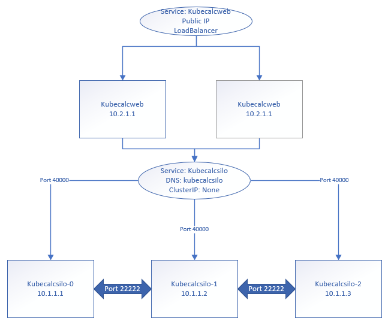
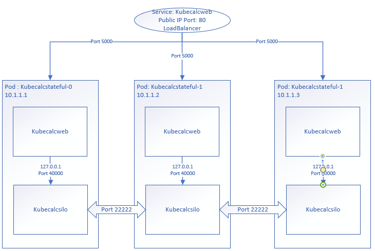

# KubeCalc using Azure Kubernetes Service (AKS)
These are instructions to build and run the sample in a docker container using Docker Compose.

## Prerequisites
To build and run these samples in containers, install [Docker Community Edition](https://www.docker.com/community-edition).

Have a previously saved secrets.json file in %AppData%\Roaming\Microsoft\UserSecrets\KubeCalc-UserSecrets as pre instructions
in [Readme](Readme.md)

Make sure that docker is in Linux container mode.

## Setup AKS Cluster
#### Create the Container Registry

Create the container registry.  In this document we name the registry _akssampleregistry_.  Please create the registry using your own name.

```
az login
az account set -s "<subscription name>"
az group create -g akssamplegroup -l "Central US"
az acr create -n akssampleregistry -g akssamplegroup -l "Central US" --sku Basic
```
#### Build Container Images

To build both _kubecalcsilo:latest_ and _kubecalcweb:latest_ images.

```
cd Samples\2.0\Kubernetes\src
docker-compose build
```

#### Push Container Images to Container Registry
Login into the Container Registry and cache the credential on your machine.  
```
az acr login -n akssampleregistry
az acr show -n akssampleregistry
```

The show command should show data about your container registry.  Specifically look for the loginServer.

```
"loginServer": "akssampleregistry.azurecr.io"
```

Tag your local image and push the images to the remote Container registry by putting the loginServer value in front of the tag (loginServer/image:version).
```
docker tag kubecalcsilo:latest akssampleregistry.azurecr.io/kubecalcsilo:latest
docker push akssampleregistry.azurecr.io/kubecalcsilo:latest

docker tag kubecalcweb:latest akssampleregistry.azurecr.io/kubecalcweb:latest
docker push akssampleregistry.azurecr.io/kubecalcweb:latest
```

#### Create Kubernetes Cluster

Lets create a kubernetes cluster of 3 machines.

```
az aks create -g akssamplegroup -n akssamplecluster -l "Central US" --node-count 3
```
#### Set Kubernetes Permission to Registry

Kubernetes cluster needs permission to read from the Container Registry.  To do this edit the powershell script Samples\2.0\Kubernetes\deployment\AKS\acrassignment.ps1 and change the variables to your own.

$AKS_RESOURCE_GROUP="akssamplegroup"
$AKS_CLUSTER_NAME="akssamplecluster"
$ACR_RESOURCE_GROUP="akssamplegroup"
$ACR_NAME="akssampleregistry"

Run the script in powershell.
```
cd Samples\2.0\Kubernetes\deployment\AKS
powershell .\acrassignment.ps1
```

#### Setup Kubectl Access
```
az aks install-cli
az aks get-credentials -g akssamplegroup -n akssamplecluster
kubectl get nodes
```
This should return you the 3 nodes that you have created.  You are now ready to deploy to kubernetes.

```
kubectl run kubecalcsilo --image akssampleregistry.azurecr.io/kubecalcsilo:latest
kubectl get pods
kubectl logs kubecalcsilo-xxxxx
```
When reading logs for a pod, use the pod name that is listed from the get pods command.  We should see that our silo ran but there is an error because /etc/secret/secret.json was not found.

Delete this deployment.
```
kubectl get deployment
kubectl delete deployment kubecalcsilo
```
#### Setup the Secret
Now we need to copy our secrets.json file into the kubenetes secret store so it can be mapped into our container when deployed.

```
cd %APPDATA%\Microsoft\UserSecrets\KubeCalc-UserSecrets\
kubectl create secret generic kubecalcsecret --from-file=secrets.json
```

## Deploy kubecalc

#### Deploy as Two Services
Open the file _kubecalc-twoservice.yaml_ and edit the file replacing _akssampleregistry.azurecr.io_ with your container registry.  Running this command will deploy kubecalsilo and kubecalcweb containers as separate services.
```
kubectl apply -f kubecalc-twoservice.yaml
```
The diagram below illustrates the configuration of this deployment.  The kubecalcsilo is deployed as an internal service with no load balancer (ClusterIP: None).  Resolving the DNS name kubecalcsilo will return the 3 addresses of the silo.  In this deployment we pass silohost=kubecalcsilo as an argement which will use the class DnsNameGatewayListProvider to periodically look up the DNS name.  The return ip list will can dynamically chage when scaling the silo instances up or down.  An alternative is to use UseAzureStorageClustering() on the client which will require injection of secrets.json in the kubecalcweb container.



Run this command and look at the external IP of the kubecalcweb service.  Open the browser to this address http://{externalip}.
```
kubectl get pod,service,deployment,statefulset
```
We can scale the silo up the silo using the command.
```
kubectl scale statefulsets/kubecalcsilo --replicas=10
kubectl get pod,service,deployment,statefulset
```

Run the delete command to remove the deployment.
```
kubectl delete -f kubecalc-twoservice.yaml
```
## Deploy to a Single Pod
TODO

